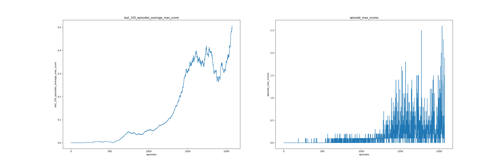

# Project Report

Here is a report of the method used to solve the tennis multi agent unity environment. The environment involves two agents controlling rackets to bounce a ball over a net. The observation is continuous with 
24 values corresponding to the position and velocity of the ball and racket. The  action space is continuous being a 
2 dimensional vector corresponding to the movement of the racket towards the net, and jumping. An agent receives a 
reward of 0.1 for hitting the ball over the net and -0.01 for letting the ball hit the ground or go out of bounds.

The task is solved when the average score of 100 episodes greater than or equal to 0.5. The score of each episode is considered as the 
maximum of the undiscounted returns from the agents.

A DDPG agent was used to solve the environment. This is the toughest assignment so far! Spent so much time setting the 
hyperparameters and changing the model architecture

## DDPG Agent
DDPG can be thought of as DQN for continuous actions. It uses an actor take actions in the environment. 
This action is considered a greedy action as it is the best action for the given state. 
A critic estimates the value of an action in any given state. 
The goal here is to maximize the value of whatever action the actor takes, with an assumption that it is the optimal action.
When trained this way, the DDPG agent would always take the best/greedy action at any given state.

**Actor model**

The actor model is an MLP that outputs a distribution over actions from which an agent can sample from. Its input is 
the observation from the environment. It has 3 layers with the first and last hidden layers having 256 and 128 units 
respectively. Each hidden unit is followed by a rectified linear unit activation. The output is passed through a tanh 
activation to ensure that actions are in the range [-1,1]

**Critic model**

The model for the critic is a simple MLP with 3 layers. The output layer is with one unit with no activation and the 
input to the model is the observation (24 dim vector) from the environment. Each of the 2 hidden layers are followed by
a relu activation and have 256 and 128 units respectively .

The actor and critic models implementation can be found in [model.py](ddpg/model.py)

## Training parameters

Traning was done using an adam optimizer with a learning rate of 1e-4 for both the actor and critic with batch size of 128. The parameters for training can be configured in the [config.py](config.py)

Below is a description of the parameters found in [config.py](config.py).

Name | data type | Use
--- | --- | ---
BUFFER_SIZE | int | maximum size of the buffer
BATCH_SIZE | int | batch size to sample from the buffer
GAMMA | float | discount factor
ACTOR_HIDDEN_DIM | list | hidden layers for actor model
CRITIC_HIDDEN_DIM | list | hidden layers for critic model
ACTOR_LR | float | learning rate for the actor optimizer
CRITIC_LR | float | learning rate for the critic optimizer
TAU | float | used for target networks soft updates

## Results

After training for 2072 episodes, An average score (max score across all agents averaged over the last 100 episodes) of 0.506 was attained.
below is an image of the training progress, plots of scores and average scores attained at each episode.

The result achieved with the DDPG agent is outlined below;

Episodes | average score (last 100 episodes) 
--- | --- 
2072 | 0.506 

## Possible Improvements

For improvements over the current results, other settings of the hyper-parameters can be tried out. Also, the use of prioritized experience replay for DDPG can be explored.
